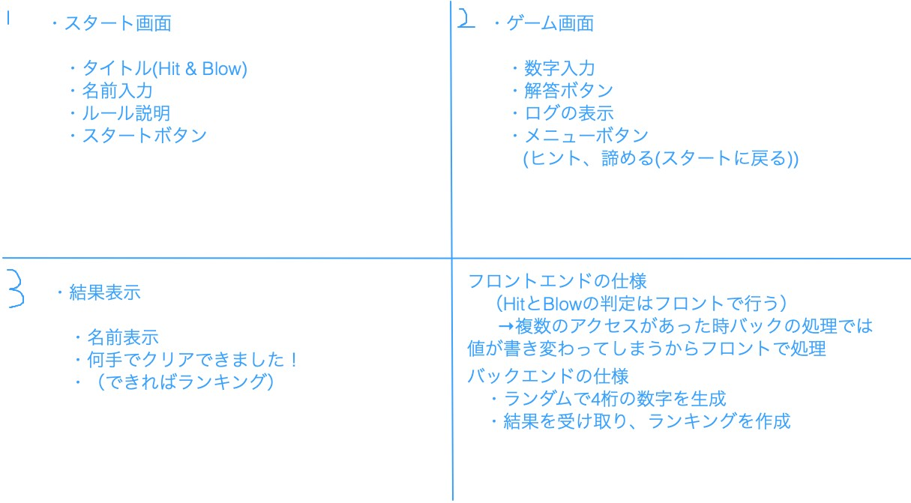

# オブジェクト指向プログラミングおよび演習 第12回進捗レポート

## 作成者
- 学籍番号：[kk]19064
- 氏名：高田優一
- グループ： 2

    - メンバー
    - k19133 山村友介（チームリーダー）
    - k19023 大山正貴
    - k19055 志村知樹
    - k19060 鈴木巧
    - k19064 高田優一
    - k19092 福田遥生
    

## 仕様
- GUIのゲーム(Hit and Blow)

[ルール説明]
- スタート画面で名前を入力
- ランダムで4桁の数字を生成(同じ数字は重複して使えない　○：0469 ×：6338)
- ユーザがランダム4桁の数字を予想して入力
-  数字と桁の位置が一致していればHit +1
-  桁の位置は違うが数字が一致していればBlow +1
- HitとBlowの値を表示（ログを残す）
- Hit 4 になったらゲームクリア,ならなかったら(＊)から繰り返す
- 結果表示画面にてクリアメッセージを表示し、名前とクリアにかかった手数をランキングに記載

[役割分担]
- スタート画面（担当：k19060 鈴木）
- ゲーム画面（担当：k19064 高田）
- 結果表示画面（担当：k19023 大山）
- バックエンド(ランダム4桁の数字生成などの小さいモジュールの作成)（担当：k19055 志村）
- バックエンド(ランキング作成、バックエンド全体の統括)（主担当：k19092 福田、副担当：k19055 志村）

[アプリ仕様またはアプリ完成イメージ]

## 作業報告
- チームメンバーと話し合って、アプリ仕様と作業内容を決めた  
  
- 作業ブランチ:playingScreen
- アカウント:takata064
- Hit and Blowでのログ機能やヒントを表示する機能を追加
    - [プルリクエストを送信](https://github.com/2020-AIT-OOP2-Group2/Hit_and_Blow/pull/15)
    - マージされた

## 振り返り（感想など）
- 担当している部分は、データを共有するところ以外は完成させることができた。
- 自分の担当箇所が早めに完成してしまうことが考えられるので、画面のレイアウトを凝るといった追加の作業をどうするか話し合う必要がある。