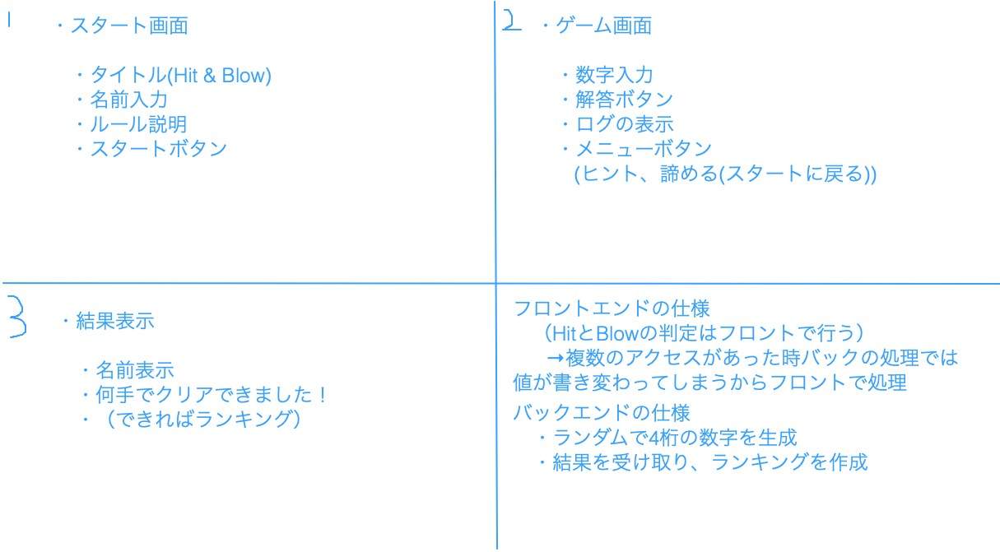

# オブジェクト指向プログラミングおよび演習 第12回進捗レポート

## 作成者
- 学籍番号：[kk]19064
- 氏名：高田優一
- グループ： 2

    - メンバー
    - k19133 山村友介（チームリーダー）
    - k19023 大山正貴
    - k19055 志村知樹
    - k19060 鈴木巧
    - k19064 高田優一
    - k19092 福田遥生
    

## 仕様
- GUIのゲーム(Hit and Blow)

[ルール説明]
- スタート画面で名前を入力
- ランダムで4桁の数字を生成(同じ数字は重複して使えない　○：0469 ×：6338)
- * ユーザがランダム4桁の数字を予想して入力
-  数字と桁の位置が一致していればHit +1
-  桁の位置は違うが数字が一致していればBlow +1
- HitとBlowの値を表示（ログを残す）
- Hit 4 になったらゲームクリア,ならなかったら(＊)から繰り返す
- 結果表示画面にてクリアメッセージを表示し、名前とクリアにかかった手数をランキングに記載

[役割分担]
- スタート画面（担当：k19060 鈴木）
- ゲーム画面（担当：k19064 高田）
- 結果表示画面（担当：k19023 大山）
- バックエンド(ランダム4桁の数字生成などの小さいモジュールの作成)（担当：k19055 志村）
- バックエンド(ランキング作成、バックエンド全体の統括)（主担当：k19092 福田、副担当：k19055 志村）

[アプリ仕様またはアプリ完成イメージ]

## 作業報告
- アプリ仕様と作業内容を話し合って決めた  

- 作業ブランチ:playingScreen
- htmlで基本的なプレイ画面の構成を作成,入力した数字の取得とそれが正しいか判断するものを作成
    - [プルリクエストを送信](https://github.com/2020-AIT-OOP2-Group2/Hit_and_Blow/pull/3)
    - マージされた  

- Hit and Blowをプレイできるように、その判定部分を作成
    - [プルリクエストを送信](https://github.com/2020-AIT-OOP2-Group2/Hit_and_Blow/pull/7)

[自分のコミット履歴]
<pre>
* commit ef0b95e302d60ec1d69fdeff8c8d6d62bd2b4fd9 (HEAD -> playingScreen, origin/playingScreen)
| Author: k19064 <ttt562777@icloud.com>
| Date:   Mon Dec 14 21:27:56 2020 +0900
| 
|     Hit and Blowの判定部分の完成
| 
* commit 3f8a4a1273e5956e05bf65c09416cb86c23e9936
| Author: k19064 <ttt562777@icloud.com>
| Date:   Thu Dec 10 20:16:20 2020 +0900
| 
|     不具合の修正
|     
|     数字を判定するところが間違っていた
| 
* commit 4065f8e1fe2f4580e0c205e64ac6b2216790731c
| Author: k19064 <ttt562777@icloud.com>
| Date:   Thu Dec 10 19:20:30 2020 +0900
| 
|     入力の判定の修正
|     
|     文字が含まれているか
|     桁数があっているか
|     ユニークかどうか
| 
* commit 5c5411ec4ce55eb1709064de5930f8e37ccd2b39
| Author: k19064 <ttt562777@icloud.com>
| Date:   Thu Dec 10 15:56:42 2020 +0900
| 
|     ユニークでない数列は弾くように設定
| 
* commit af90fd45f3e72ef37850d4226a342c3bb28d3d2c
| Author: k19064 <ttt562777@icloud.com>
| Date:   Thu Dec 10 15:31:51 2020 +0900
| 
|     Update playRequest.js
|     
|     jsの内容修正
| 
* commit cf5f4a2819d0ced5c861c1b03c9b9a582dfead5e
| Author: k19064 <ttt562777@icloud.com>
| Date:   Thu Dec 10 15:29:03 2020 +0900
| 
|     htmlとjsの変更
|     
|     基本的なhtmlの内容とjsの形だけ作成
| 
* commit 9a3fbbfd7d4234b4af740c3e43f69732b263b321
| Author: k19064 <ttt562777@icloud.com>
| Date:   Thu Dec 10 15:03:36 2020 +0900
| 
|     jsの追加だけ
| 
* commit 3e01b57105b3190d76f62c22b4be87411c41b6e3
| Author: k19064 <ttt562777@icloud.com>
| Date:   Thu Dec 10 14:51:38 2020 +0900
| 
|     Create PlayingScreen.html
| 
* commit 223ec8ce0e6e37d148767095bb86bdd3b6b7102d
| Author: yamamura-kk <75057766+yamamura-kk@users.noreply.github.com>
| Date:   Thu Dec 10 14:32:41 2020 +0900
| 
|     Update README.md
| 
* commit 3c62ba5dcc2f3d83032696e444cb1011c4e1fd6f
| Author: yamamura-kk <75057766+yamamura-kk@users.noreply.github.com>
| Date:   Thu Dec 10 14:28:32 2020 +0900
| 
|     first commit
| 
* commit a3124cc3bc231aed9c7e3d0a7c03f2595a56a697
  Author: yamamura-kk <75057766+yamamura-kk@users.noreply.github.com>
  Date:   Thu Dec 10 14:20:27 2020 +0900
  
      Initial commit
</pre>

## 振り返り（感想など）
- 担当している部分は予定どうり順調に作業が進んでいる
- この調子で作業を続けていきたい。また、他のクライアント部分の作業が技術的な要因であまり進んでいないようなのでサポートできるところはしっかりとしていきたい。